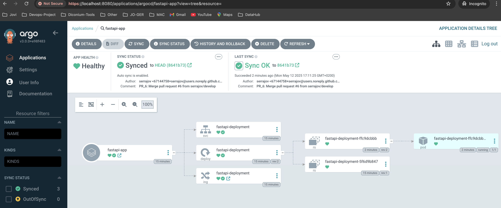
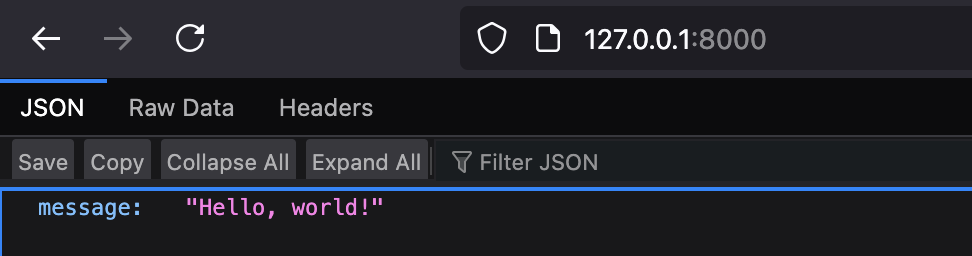
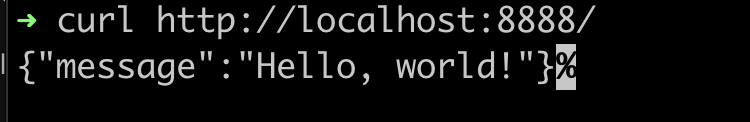
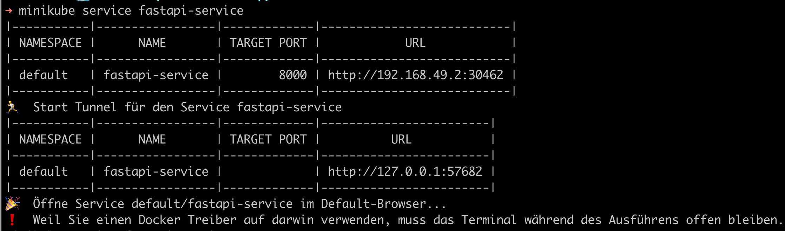
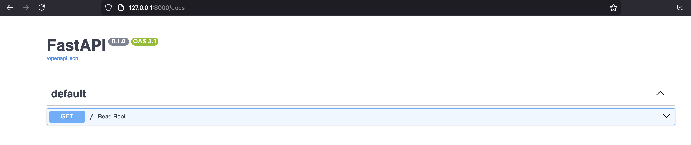
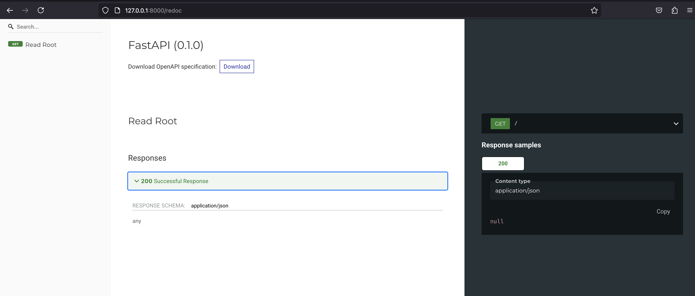

# Part 1 - Coding Challenge

---

## FastAPI Kubernetes Deployment with ArgoCD

This project demonstrates the setup and deployment of a simple **FastAPI** application using **Docker**, **Minikube**, **Kubernetes**, and **ArgoCD** for GitOps. The entire setup is designed for local development and testing using a minimal but production-like stack.

---

## 📂 Directory Structure

```
.
├── additional-files
│   ├── docker-secret.yaml
│   ├── images
│   │   ├── img1.png
│   │   ├── img2.png
│   │   ├── img3.png
│   │   ├── img4.png
│   └── repo-secret.yaml
├── app-code
│   ├── Dockerfile
│   ├── main.py
│   └── requirements.txt
├── argocd
│   └── application.yaml # ArgoCD Application file
├── helm
│   └── fastapi-app
│       ├── Chart.yaml
│       ├── templates
│       │   ├── _helpers.tpl
│       │   ├── deployment.yaml
│       │   ├── ingress.yaml
│       │   └── service.yaml
│       └── values.yaml
├── .github
│     └── workflows
│          ├── ci.yaml  # CI pipeline used to build & push
└── README.md
```

---

## ✅ Prerequisites

* GitHub Account and repository
* Docker Hub Account and repository
* Git Cli installed
* Kubernetes Cli installed (kubectl)
* Helm installed
* Minikube installed (on local machine)
* ArgoCD installed (on your local machine)
* ArgoCD Cli installed

---

## 🔧 Setup Instructions

### 1. FastAPI Application

The entire application code is defined in the directory [app-code](./app-code/).
Below are the contents: 
- The mock FastAPI endpoint is defined in `app-code/main.py`. 
- The required dependencies is present in `app-code/requirements.txt`.
- Containerzed application is defined in file `app-code/Dockerfile`.

*Note: Reference link: [FastAPI](https://fastapi.tiangolo.com/tutorial/first-steps/)*
---

### 2. CI Pipeline

Located at [ci.yaml](./.github/workflows/ci.yaml). This workflow is used to build and push FastAPI application images to docker hub.

#### 🔐 GitHub Secrets Required

| Secret Name         | Description |
|---------------------|-------------|
| `DOCKER_USERNAME`   | Username for docker login of a user on Dockerhub  |
| `DOCKER_PASSWORD`   | Password for docker login of a user on Dockerhub  |
| `KUBECONFIG`        | Base64-encoded kubeconfig file for local Minikube |

To obtain & encode your kubeconfig:
```bash
kubectl config view --minify --context=minikube --flatten > minikube-only-kubeconfig.yaml

base64 -i minikube-only-kubeconfig.yaml | tr -d '\n' -o kubeconfig_gh_secret
```

*Note: By default the kubeconfig is stored in ~/.kube/config*

#### Trigger
- It is automatically triggered for push and pull_request events.
- Can be manually triggered as well.

#### Badge

[](https://github.com/serrajov/FastAPI/actions/workflows/ci.yaml)

---

### 3. Minikube Setup

*Start Minikube:*

```bash
minikube start
minikube addons enable ingress
minikube tunnel
```

*Add Docker Credential to minikube cluster:* </br>
This can be done using kubectl create command and sample of it is located at [docker-secret](./additional-files/docker-secret.yaml).

*Note:*
- Keep the tunnel running to access the ingress controller.
- Wait for few mins after enabling the ingress, since it needs time to get all the necessary pods into the running state.
- Reference link: [install minikube](https://minikube.sigs.k8s.io/docs/start/?arch=%2Fmacos%2Fx86-64%2Fstable%2Fbinary+download)

---

### 4. Install and Configure ArgoCD

*Setup*
```bash
kubectl create namespace argocd
kubectl apply -n argocd -f https://raw.githubusercontent.com/argoproj/argo-cd/stable/manifests/install.yaml
```

*Check ArgoCD pods:*
```bash
kubectl get pods -n argocd
NAME                                                READY   STATUS    RESTARTS   AGE
argocd-application-controller-0                     1/1     Running   0          20h
argocd-applicationset-controller-559fd7586b-72shq   1/1     Running   0          20h
argocd-dex-server-7f74fbb556-hgp52                  1/1     Running   0          20h
argocd-notifications-controller-7b964f64b5-z5v2s    1/1     Running   0          20h
argocd-redis-56858b8cf6-t75vs                       1/1     Running   0          20h
argocd-repo-server-7575788594-m7zdn                 1/1     Running   0          20h
argocd-server-b558994c6-glkqh                       1/1     Running   0          20h
```

*Access ArgoCD UI:*
```bash
kubectl port-forward svc/argocd-server -n argocd 8080:443
```

Then open: [https://localhost:8080](https://localhost:8080)

*Connect Github and ArgoCD:* </br>
Choose connection method as Http/Https and use Github user credentials and repo url .

*Create a PAT token in Github:* </br>
A classic PAT token can be used for this project.

*Connect ArgoCD to minikube k8s cluster:* </br>
Create a secret in k8s to allow ArgoCD to access the minikube cluster. Sample file located at [repo-secret](./additional-files/repo-secret.yaml).

```bash
kubectl apply -f repo-secret.yaml

secret/fastapi-git-https created
```

*Note: Reference link: [Install ArgoCD](https://argo-cd.readthedocs.io/en/stable/getting_started/)*
---

### 5. ArgoCD Application Configuration

File located at [argocd_app](./argocd/application.yaml).

Apply with:

```bash
kubectl apply -f argocd/application.yaml
```

OR

An App can be created directly on the ArgoCD dashboard (UI), using the config file from Github.

Once synced, ArgoCD will deploy the application.

*Note: Since autosync is enabled, ArgoCD will sync regularly when changes are found in git.*

---

## 🌐 Access the API

After deployment:

```bash
minikube service fastapi-service
```

Example output:

```
| NAMESPACE |      NAME       | TARGET PORT |            URL            |
|-----------|-----------------|-------------|---------------------------|
| default   | fastapi-service |        8000 | http://192.168.49.2:30462 |
```

Or via the tunnel:

```
| default   | fastapi-service |             | http://127.0.0.1:57682 |
```

Open in browser:

```
http://127.0.0.1:8000/
```

Or test with curl:

```bash
curl http://127.0.0.1:8000
# Response: {"message": "Hello World"}
```

---

## 📌 Notes

* Make sure Docker image name in Helm `values.yaml` matches the one in your pipeline.
* Ensure ArgoCD has access to your GitHub repo.
* Minikube tunnel must stay active while accessing services.

---

## 📷 Screenshots

Refer to the included images for:

* ArgoCD Application UI </br>



* Browser access confirmation </br>



* Terminal access confirmation </br>



* Terminal output for Minikube services </br>



* Browser Access for FastAPI with docs endpoint </br>



* Browser Access for FastAPI with redocs endpoint </br>



---

## 📫 Contact

For any issues or questions, feel free to open an issue in the repo.

Happy coding! 🎉

---


