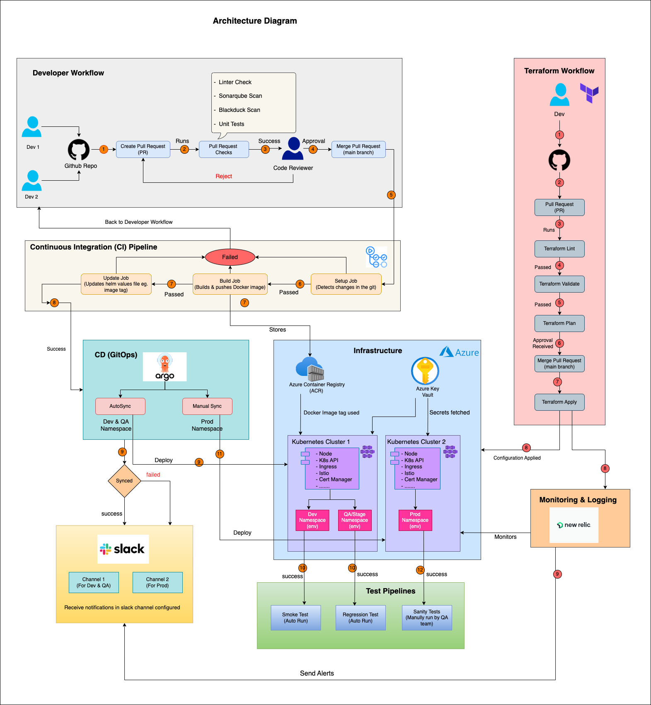
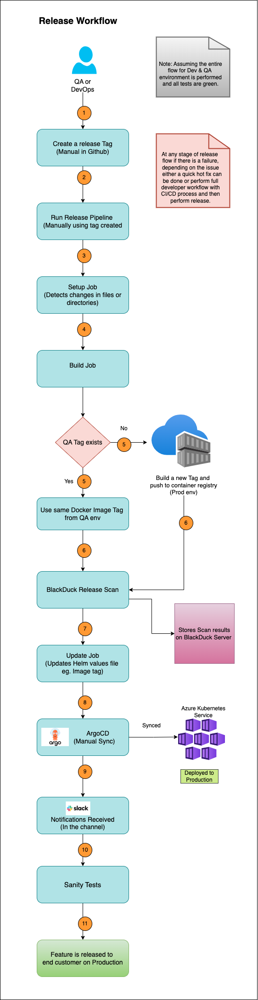

# Deployment Architecture: Security, CI/CD & Strategy

Here’s a comprehensive architecture design and description that includes **code protection**, **CI/CD pipeline**, **cluster architecture**, and **deployment strategy**. 

---

## Repository Setup

```
my-app/
├── .github/
│   └── workflows/                 # GitHub Actions CI/CD workflows
├── app/
│   └── (source code)              # Actual application code
├── charts/
│   └── my-app/                    # Helm chart for K8s deployment
├── manifests/
│   ├── dev/                       # K8s manifests or ArgoCD app YAMLs for dev
│   ├── qa/                        # K8s manifests or ArgoCD app YAMLs for qa
│   └── prod/                      # K8s manifests or ArgoCD app YAMLs for prod
├── Dockerfile
├── terraform/
│   └── azure-infra/               # Infra as code - K8s, Key Vault etc.
├── sonar-project.properties
└── README.md
```

---

## Architecture Diagram 

The architecture diagram is shown below:</br> 


---

## 🔐 Code Protection Measures

### 1. **Source Code Access Control**

* **Git Repository Hosting**: GitHub Enterprise with enforced **SSO authentication** and **Role-Based Access Control (RBAC)**.

* **Branch Protections**:

  * Enforce pull requests (PRs) for all changes to `main` branch.
  * Require code review approvals and successful CI checks before merging.
  * The CI checks could include Linter check, Sonarscan, BlackDuck scan and unity tests.
  * No direct commits allowed on `main` branch.

* **Audit Logs**:

  * Full audit trail for repository activities to track who did what and when.

### 2. **Secrets Management**

* No hard-coded secrets in source code repository.
* Use **Azure Key Vault** to manage environment secrets.
* Inject secrets at runtime using tools like **Sealed Secrets**, **Kubernetes Secrets**, or **CI/CD secret injection mechanisms**.
* Enable **CodeQL** in GitHub which scans for vulnerability and identifies hard coded secrets.
* Enable **Secret Scanning (GitHub Advanced Security)** which checks for secret patterns like API keys, tokens etc. Alerts are raised which notifies the Owner and Administrator.

### 3. **Static Code Analysis & Security Scanning**

* Integrate tools like **SonarQube**, **Linter**, **CodeQL**, or **Blackduck** in the CI pipeline to catch:

  * Vulnerabilities (e.g., SQL injection, XSS)
  * Code smells
  * License violations
  * Scan Docker images for known CVEs. 

### 4. **Dependency Updates**

* Use tools like **Dependabot** to:

  * Automatically detect outdated or vulnerable packages.

---

## Infrastructure Architecture 

The Infrastructure as Code (IaC) is developed using `Terraform` in this architecture.

### Infrastructure Workflow

* **Pull Request:** A feature branch is used to create or update the infrastructure. Once the work is done, a Pull Request is created.

* **Terrform Lint:** TFLint is a Linter used to check for any potential issues or errors. Terrfaform inbuilt has a the format feature `terraform fmt` which can be used to check for issues related to formatting, indentation and alignment.

* **Terraform Init:** This first intializes the backend and then the working directory containing configuration files and install plugins for required providers. 

* **Terraform Validate:** It is used to validate the terrform configuration provided such that it approves only for the ones supported by terraform. It points out when certain resource configuration is invalid.

* **Terraform Plan:** This will generate the complete terraform plan showing the changes reflected in the infrastructure creation, updation or deletion.

* **Merge Pull Request:** Approval is provided by reviewer when all the checks on terraform pipeline are green starting from TFLint until Terraform Plan and then merged to `main` branch.

* **Terraform Apply:** When Pull Request is merged, terraform then applies the configuration changes to the Cloud infrastructure.

**Note**: 
* `Terraform Destroy` is used to destroy the infrastructure created. 
* Complete infrastructure can be destroyed with this command and it should be used very carefully.


### Azure Infrastructure

The architecture diagram contains following infrastructure components:

* **Azure Container Registry (ACR):** This is used to store build, store and manage container images and artifacts in a private registry for all types of container deployments. 

* **Azure Key Vault:** This is a cloud service for securely storing and accessing secrets. A secret is anything such as API keys, passwords or certificates.

* **Azure Kubernetes Service (AKS):** AKS is a cloud-hosted Kubernetes Cluster that Azure provisions, scales and maintains to run containerized applications for customers.

**Note**: 
- In the diagram, only the important infrastructure components are highlighted. 
- Other Resources can be created in Azure such as virtual machines, Storage containers, databases etc depending on the requirements. 

---

## 🔄 CI/CD Pipeline Architecture

### 🧰 Tools & Technologies

* **Version Control**: GitHub
* **CI Engine**: GitHub Actions 
* **CD Platform**: ArgoCD
* **Container Registry**: Azure Container Registry (ACR)
* **IaC**: Terraform
* **Kubernetes Cluster**: Azure Kubernetes Service
* **Policy Enforcement Tool**: OPA Gatekeeper or Kyverno
* **Templating & Deployment files**: Helm
* **Monitoring & Logging**: New Relic
* **Notifications**: Slack
* **Secret Management**: Azure Key Vault & Github Secrets


### 🔁 **Feature Development & Pull Request Workflow**

1. **Feature Branch Creation**</br>
   A developer creates a dedicated `feature` branch from the `main` branch in GitHub to begin working on a new feature or enhancement.

2. **Code Development & Push**</br>
   Code changes are developed locally and pushed to the remote `feature` branch.

3. **Pull Request (PR) Submission**</br>
   Once development is complete, a **Pull Request** is created from the `feature` branch to the `main` branch.

4. **Automated Checks on PR**</br>
   Upon PR creation, a set of automated checks are triggered:

   * **SonarQube**: For code quality and static analysis
   * **Linter**: To enforce code style and standards
   * **BlackDuck**: For security and license compliance
   * **Unit Tests**: To validate functionality

5. **Code Review Process**</br>
   After all checks pass, the developer assigns the PR to a **Reviewer**.

   * If the reviewer approves the changes, the PR is marked ready for merge.
   * If not, the reviewer leaves comments or requests changes. The developer addresses the feedback and re-submits.

6. **Merge to Main**</br>
   Once approved, the Pull Request is **manually merged** into the `main` branch by the developer or reviewer.

7. **CI Pipeline Trigger**</br>
   Merging to `main` automatically triggers the **CI pipeline** for deployment to **Dev** and **QA** environments.

8. **Iteration**</br>
   Developers can work on multiple feature branches independently, each following this same lifecycle.


### 🔧 Continuous Integration (CI) Steps

1. **Setup**

   * Here code is checked out to fetch code from a specific branch. 
   * It also contains `detect changes` actions from Github Marketplace which is used to identify changes in files and directories in the repository.

2. **Build**

   * Compile code / build docker image & push to Azure container registry.

3. **Update Helm**

   * The relevant helm values file is updated for docker image tag for respective environment. For eg. For dev, values-dev.yaml file.


### 🚀 Continuous Delivery/Deployment (CD) Steps

1. **Pull from GitOps Repo**

   * ArgoCD watches a Git repo for desired state changes and performs sync.

2. **Apply K8s Manifests created using Helm Charts**

   * Deploy to target environment

3. **Post-deploy Steps**

   * Run smoke tests for Dev and regression tests for QA environments respectively. 
   * Health checks via readiness/liveness probes configured in Helm charts.
   * Once the sync is performed, notifications are send to slack channel.
 
---

## ☁️ Cluster Architecture & Environment Separation

### 1. **Kubernetes Cluster Architecture**

#### Platform:

* **Managed K8s** (e.g., Azure AKS)

#### Nodes:

* **Node Pools**:

  * General workloads
  * High-memory jobs
  * GPU workloads (if ML is involved)

#### Namespaces per Environment:

* **Environments** `dev`, `staging or QA`, `prod`
* **RBAC** per namespace
* **Resource quotas** to limit compute usage

#### Networking:

* **Service Mesh**: Istio for secure intra-cluster communication
* **Ingress Controller**: NGINX or AWS ALB Ingress for routing
* **Cert Manager**: Certificates obtained from issuers (eg. Digicert) for applications which ensure they are valid and up-to-update.
* **Kyverno**: Policy enforcement tool for k8s that defines and enforces rules for deployments and resources to be created in the cluster.

#### Clusters:

* **Number of clusters**: Two clusters used where one cluster contains Dev and QA namespace and the other cluster is only for Prod. Production Cluster will usually have a different configuration eg. increased replicasets, highly availability, Autoscaling enabled etc. 

### 2. **Environment Separation**

| Environment | Description                                                                            |
| ----------- | -------------------------------------------------------------------------------------- |
| `dev`       | For developers. Auto-deployed. Lower resource limits.            |
| `staging or qa`   | Mirrors prod. Auto-deployed. Used by QA team.                    |
| `prod`      | Stable environment. Manual approval. Monitored tightly. |

---


##  Deployment Strategy

###  **Release Workflow Diagram**

Shown below:</br>


---

###  **Production Release Process**

Assuming CI/CD pipelines have successfully passed in both **Development** and **QA** environments, including green results for **smoke** and **regression** tests, the release process to Production can be initiated.

---

#### 🚀 **1. Release Tag Creation**

* A `Release Tag` is **manually created** in GitHub by the **QA** or **DevOps** team member responsible for the release.
* This tag is used to identify the exact version of the code to be released to Production.


#### 🛠 **2. Release Pipeline Execution**

Once the tag is created, the **Release Pipeline** is triggered. This pipeline consists of four sequential jobs:

#### ✅ Setup Job

* Detects and identifies changes in the files or directories within the GitHub repository.
* Determines whether a new build is necessary based on code changes.

#### 🔧 Build Job

* Builds the containerized application.
* If the image tag used in the QA environment already exists, the **same tag is reused** for Production.
* If not, a **new image** is created, built, and pushed to **Azure Container Registry (ACR)**.

#### 🔒 BlackDuck Release Scan

* Performs a **security and license compliance scan** on the container image.
* Results are sent to the **BlackDuck server** for tracking and can be reviewed via the **BlackDuck dashboard**.

#### ✏️ Update Job

* Updates the **image tag** (e.g., GitHub SHA/hash) in the Helm `values.yaml` file to point to the correct version for deployment.

#### 🚢 **3. Deployment to Production**

* Navigate to the **ArgoCD Dashboard**.
* Manually **sync the application** using the updated Helm values.
* Upon sync completion (success or failure), **notifications** are automatically sent to the relevant **Slack channel**.

#### 🔍 **4. Manual Sanity Testing**

* After receiving a successful sync notification, the **QA team** conducts **manual sanity checks** in the **Production environment**.
* These checks validate that **critical paths and core functionality** are working as expected in the live system.

#### 📣 **5. Final Confirmation and Communication**

* Once the QA team gives the **green light**, stakeholders are informed that the release is complete.
* A **public announcement** is then made, highlighting **new features or updates** now available to customers.

---

### 3. **Failure Recovery**

* **Rollback support:** via GitOps (ArgoCD tracks Git as source of truth)
* **Readiness/liveness probes:** for pod health

### 4. **Monitoring & Logging**

* In the architecture diagram, **New Relic** is used for both monitoring and logging.
* Alerts can be configured in New Relic and send notifications to slack channel when an anomaly is detected.
* New Relic supports AKS cluster monitoring by providing full observability into health, performance and usage of containerized application and infrastructure.
* Logging is supported by collecting, parsing, and forwarding logs from AKS including both platform-level logs (like system, kublet, ingress) and application logs (from microservices). 

---

## 📫 Contact

For any issues or questions, feel free to open an issue in the repo.

---
